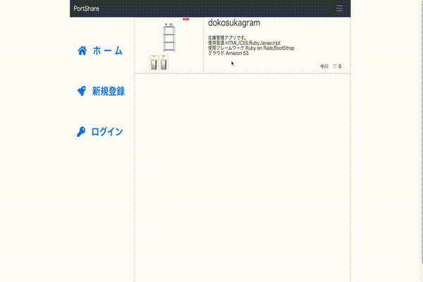
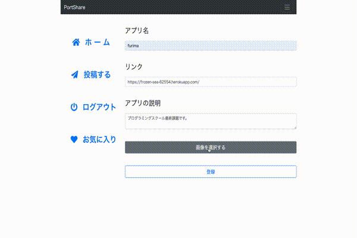
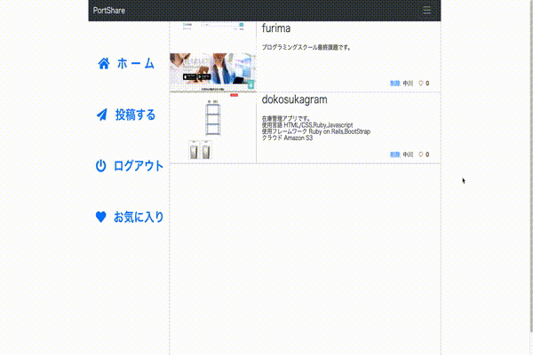
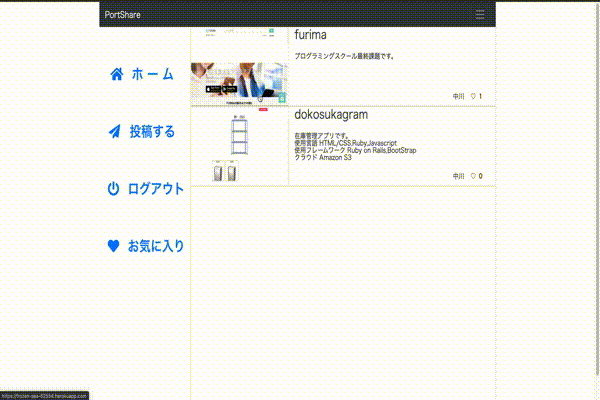

# README
# SharePort

## 作ったアプリを発信り共有したい
- 開発の経緯

このアプリを開発した経緯は、何かアプリを作っても発表する機会があまり無かったり、 
他の人がどのような物を作っているのか気になったので、人の作品が見れるサイトがあればと思い作成しました。 
実際に運用する場合はメッセージ機能をつけ、企業と求職者の仲介が出来ればと思います。

- 苦労した点

twitterのようないいね機能と、ログイン中のユーザーがいいねしたポートフォリオだけを取り出すのに苦労しました。

***デモ***
## ログイン

## ポートフォリオの登録

## お気に入りの登録

## ポートフォリオに遷移する

## 機能

- ユーザー登録
- ポートフォリオの登録
- お気に入りの登録
- ポートフォリオに遷移する

## デプロイ

1. Heroku(https://shareport.herokuapp.com/) 

## その他
- 使用言語 HTML/CSS,Ruby,Javascript 

- 使用フレームワーク Ruby on Rails,BootStrap 

- クラウド Amazon S3
